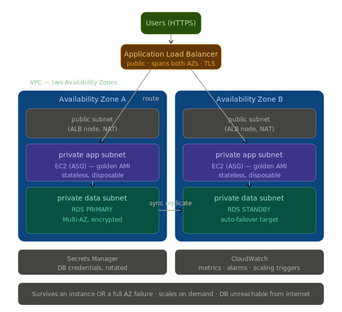

# MarketBase — highly available three-tier web application

A dynamic web app that survives instance and AZ failures and scales with traffic.

### Three-tier breakdown
- Presentation: internet-facing ALB across 2 AZs, TLS termination.
- Application: Auto Scaling Group of EC2 (golden AMI) in private subnets across 2 AZs, stateless.
- Data: RDS Multi-AZ in private subnets; credentials in Secrets Manager.

## Why these choices
- **Multi-AZ everything** so one data center failing can't take the site down.
- **Public/private split** so only the ALB is internet-facing; app and DB are private.
- **Stateless, disposable instances** from a golden AMI, so any instance can be replaced losslessly (self-healing ASG).
- **SG-referencing-SG** (ALB→app→DB) so each tier trusts only the tier in front of it, by identity.
- **Secrets Manager** so DB credentials are never in code and rotate automatically.
- **Target-tracking auto-scaling** on CPU for automatic elasticity.

## Demonstrated resilience
- Terminated an instance → ASG auto-replaced it, zero downtime.
- Multi-AZ RDS failover → standby promoted automatically, endpoint unchanged.

## Cost & teardown
ALB, NAT, and Multi-AZ RDS are billable — built, demonstrated, and torn down same-day. Teardown order documented.
