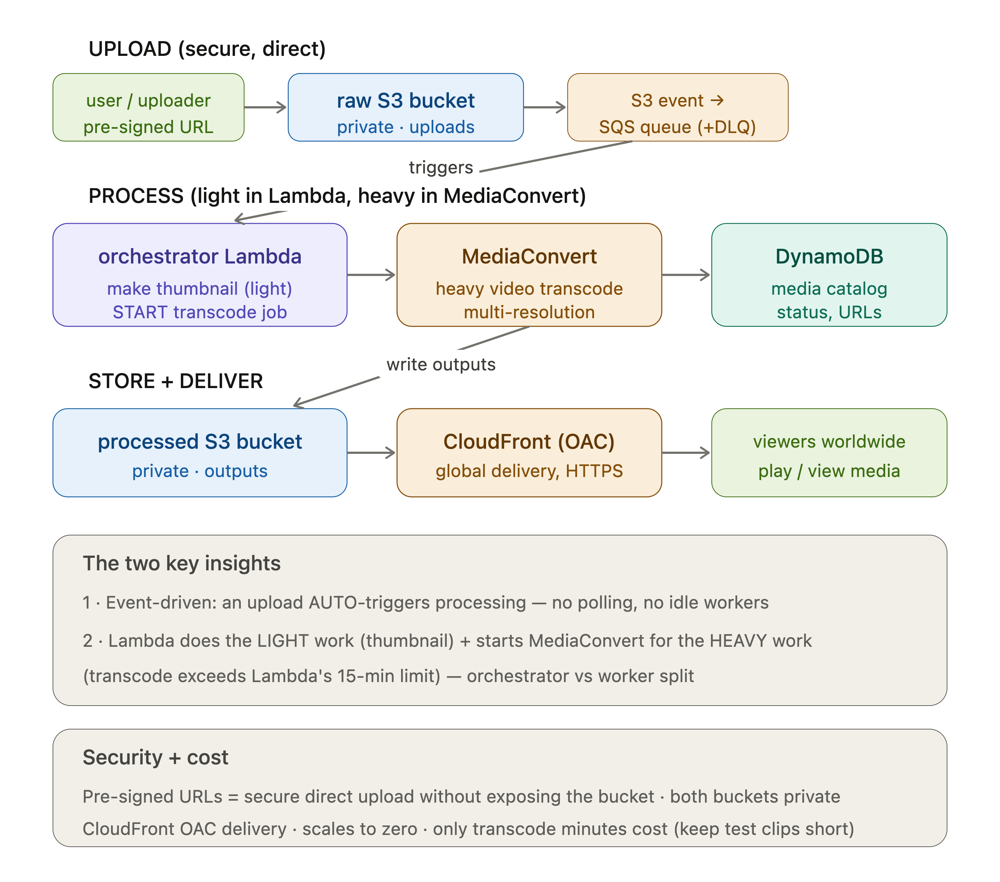

```markdown
# MediaForge — event-driven media processing pipeline

Upload a video; the system automatically generates a thumbnail, transcodes it into multiple resolutions, and serves the result globally — with no servers running when idle.



### Flow
Pre-signed upload → raw S3 → S3 event → SQS → orchestrator Lambda (thumbnail + start MediaConvert) → processed S3 → CloudFront delivery; DynamoDB catalog tracks status; EventBridge marks READY on completion.

## Key design decisions
- **Event-driven:** an upload auto-triggers processing — no polling, no idle workers, scales to zero.
- **Orchestrator vs worker:** Lambda does light work (thumbnail) and *starts* MediaConvert for heavy transcoding, because transcoding exceeds Lambda's 15-min limit.
- **Queue between S3 and Lambda:** smooths upload bursts and gives durable retries + DLQ.
- **Pre-signed URLs:** secure direct-to-S3 upload without exposing the bucket or routing big files through compute.
- **Private origins + CloudFront OAC:** media delivered globally without public buckets.
```