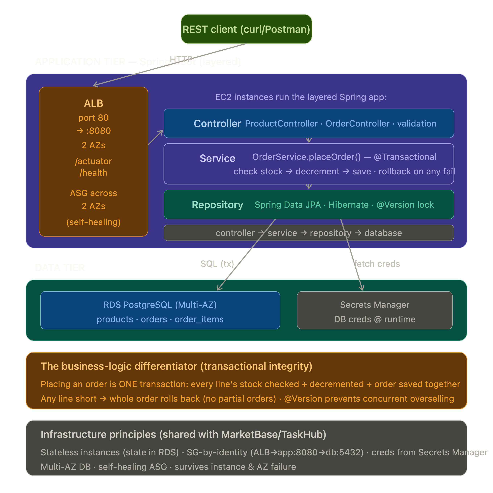

```markdown
# InventoryIQ — inventory & order management API (Spring Boot + PostgreSQL)

A real enterprise-Java three-tier application: manage products and stock, place orders that decrement inventory transactionally. Layered Spring Boot architecture deployed on AWS (EC2 + ALB + RDS).



- Presentation: documented REST API (curl/Postman/Swagger).
- Application: Spring Boot on an Auto Scaling Group of EC2 across 2 AZs behind an ALB.
- Data: RDS PostgreSQL (Multi-AZ); credentials in Secrets Manager.

## App highlights
- Layered architecture: controller → service → repository → DB.
- JPA/Hibernate entities; Spring Data repositories.
- **Transactional order placement:** stock decremented atomically; full rollback on any failure — no partial orders.
- **Optimistic locking** (@Version) prevents concurrent overselling.
- Bean Validation + global exception handler (404 / 409 / 400).

## Key design decisions
- @Transactional service method makes order placement all-or-nothing.
- @Version optimistic lock guards concurrent stock updates.
- Credentials from Secrets Manager (never hardcoded), fetched at startup.
- SG-by-identity (ALB → app:8080 → db:5432); stateless app tier; self-healing ASG; Multi-AZ RDS.

## Run locally
JDK 17 + Maven + PostgreSQL → `mvn spring-boot:run` → `curl localhost:8080/actuator/health`.
```