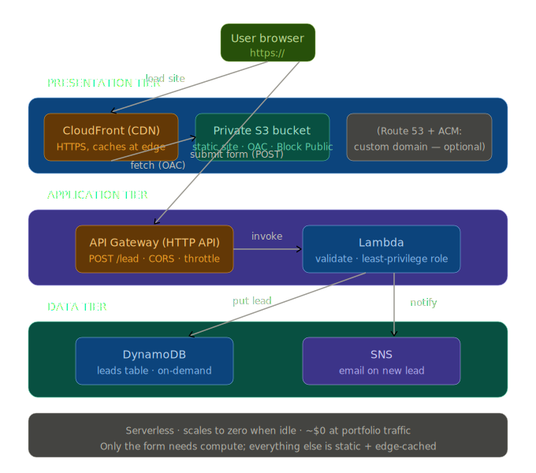

# ShopFront — Serverless retail storefront with lead capture

A globally-fast static storefront with a serverless contact form, built on AWS. Three-tier, serverless, runs at ~$0.

## The problem
A small retailer needs a fast, always-available storefront with a "request a quote" form that captures leads — without managing servers or paying for idle capacity.

### Three-tier breakdown
- **Presentation:** Route 53 (DNS) → CloudFront (CDN + HTTPS via ACM) → private S3 bucket (static site).
- **Application:** API Gateway (HTTP API) → Lambda (validate + store).
- **Data:** DynamoDB (leads) + SNS (new-lead email).

## Why these services
| Service | Role | Why |
|---|---|---|
| S3 | Static site storage | Cheap, durable, private behind CloudFront |
| CloudFront | Global CDN, HTTPS | Fast worldwide; keeps the bucket private via OAC |
| ACM | TLS certificate | Free, auto-renewing (DNS validation); us-east-1 for CloudFront |
| Route 53 | DNS | Alias record to CloudFront on a custom domain |
| API Gateway | Form endpoint | Managed, scalable, CORS + throttling |
| Lambda | Form logic | Pay-per-invoke, no idle cost |
| DynamoDB | Lead storage | Serverless NoSQL, on-demand capacity |
| SNS | Notification | Decoupled email on each new lead |

## Key design decisions
- **Serverless** because lead capture is bursty and intermittent — paying for idle servers makes no sense.
- **Static front-end** because the storefront content rarely changes; only the form needs compute.
- **Private S3 + CloudFront OAC** so the bucket is never public — the bucket policy grants only the CloudFront service principal, scoped to the distribution ARN, while Block Public Access stays on.
- **Least-privilege Lambda role** scoped to exactly the one table and one topic.
- **ACM cert in us-east-1** because CloudFront only reads certs from that region.
