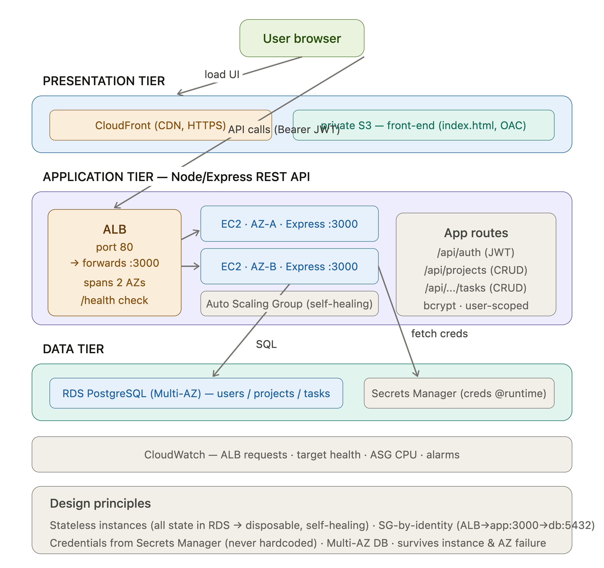

```markdown
# TaskHub — task & project management app (Node/Express + PostgreSQL)

A real three-tier web application: register, create projects, manage tasks. Express REST API with JWT auth and a relational data model, deployed on AWS (EC2 + ALB + RDS).

## Architecture


- Presentation: static front-end on S3 + CloudFront.
- Application: Node/Express API on an Auto Scaling Group of EC2 across 2 AZs, behind an ALB.
- Data: RDS PostgreSQL (Multi-AZ); credentials in Secrets Manager, fetched at runtime.

## App highlights
- bcrypt-hashed passwords + JWT auth.
- Data model: users → projects → tasks (FK cascades), every query user-scoped.
- Full CRUD REST API with input validation and proper status codes.
- Stateless app tier — all state in RDS, so instances are disposable (self-healing ASG).

## Key design decisions
- Credentials in Secrets Manager (never hardcoded), fetched via the instance role.
- SG-by-identity chain (ALB → app:3000 → db:5432).
- Stateless instances behind an ALB with a `/health` check; ASG self-heals.
- Multi-AZ RDS for database HA.

## Run locally
See guide: set `.env`, `npm install`, `npm run migrate`, `npm start`.
```